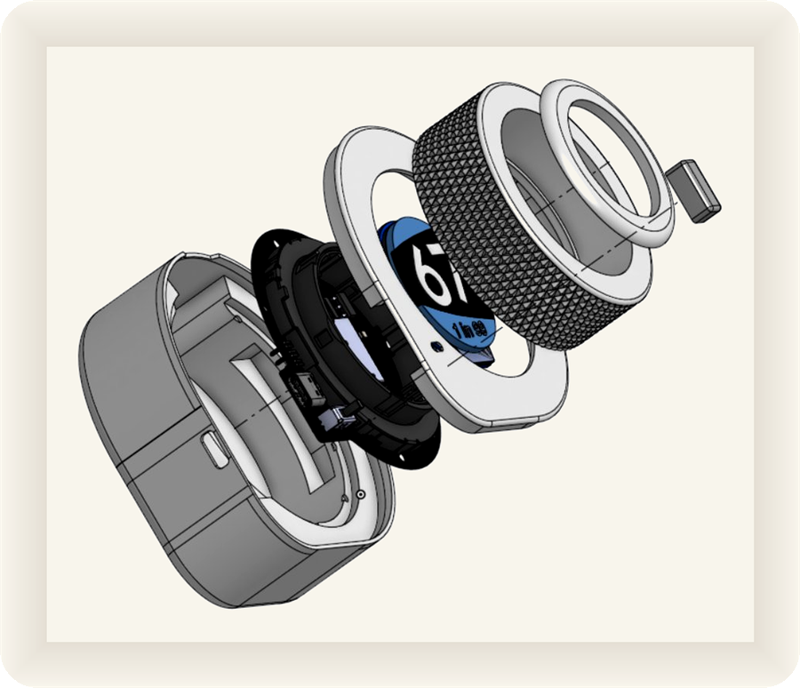

# DYCE 3D printed parts

---

The full enclosure, ready to print (STL, v5).

| File | Part |
|---|---|
| [`Bottom.stl`](Bottom.stl) | main body / base |
| [`Encoder-ring.stl`](Encoder-ring.stl) | the ring you spin (encoder) |
| [`Screen-holder.stl`](Screen-holder.stl) | holds the round GC9A01 screen |
| [`PCB-cover.stl`](PCB-cover.stl) | cover over the PCB |
| [`Button-cap.stl`](Button-cap.stl) | cap for the side power button |

## Edit the model

These STLs are exported from the parametric CAD on **Onshape**:

**[Open the DYCE CAD model](https://cad.onshape.com/documents/9054087476b99494dbf8772b/w/43f19220b97c6495800911b1/e/0047a7d77bd93aa77dba2c59?renderMode=0&uiState=6a37b72d89f368f220412795)**

To change a part or make a variation, **ask me for access**, then **make your own copy**
(Onshape, *Make a copy*) and edit freely. The original stays untouched.

## Printing

All five parts are FDM-friendly and print without drama, no exotic settings needed.

**Tested print:** I printed the whole set in **matte PLA** on a **Bambu Lab A1**, straight
from **Bambu Studio's standard 0.20 mm quality preset** with no custom tuning, and it came
out clean. PLA (matte looks great) or PETG both work well.

| Setting | What I used |
|---|---|
| Printer | Bambu Lab A1 |
| Material | Matte PLA |
| Profile | Bambu Studio · 0.20 mm Standard (default) |
| Supports | only where overhangs need them |

> **Coming soon on [MakerWorld](https://makerworld.com/)**, ready-to-print profiles,
> one click from your slicer.

Full orientation, support placement and the rest of the assembly will be covered in the
step-by-step **Instructables** build guide (coming soon).
