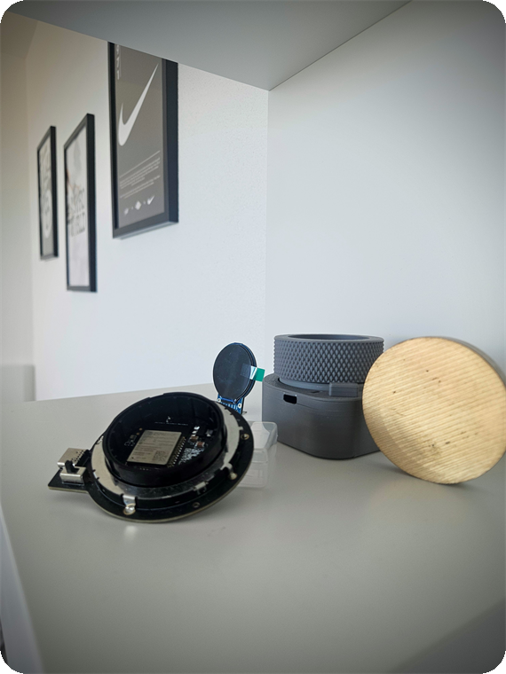

<div align="center">

# DYCE Firmware



C++ / [PlatformIO](https://platformio.org/) · ESP32-S3-WROOM-1 · GC9A01 round TFT · **100% offline**

</div>

---

## Build & flash

```bash
cd Firmware
pio run -t upload      # build & flash
pio device monitor     # serial @ 115200
```

Display & encoder pins live in [`platformio.ini`](platformio.ini) (TFT_eSPI reads them at compile time).

## Layout

| File | What it does |
|---|---|
| [`src/main.cpp`](src/main.cpp) | setup / loop, wires the encoder to the game |
| [`src/dice.cpp`](src/dice.cpp) | game state machine (intro · attract · charge · reveal) |
| [`src/ui.cpp`](src/ui.cpp) | all rendering on the round screen (sprite buffer) |
| [`src/rng.cpp`](src/rng.cpp) | fair rolls (ESP32 hardware RNG + rejection sampling) |
| [`lib/Encoder_lib/`](lib/Encoder_lib/) | the ring rotary-encoder driver |
| [`include/config.h`](include/config.h) | all the timings, colors and tunables in one place |
| `src/logo.h · icon.h · qr_image.h` | embedded images (intro logo, the "D", contact QR) |

## Make it yours

Most of the feel lives in [`config.h`](include/config.h) and [`ui.cpp`](src/ui.cpp): change
the odds, the colors, the animations or the attract tips and reflash. PRs and forks welcome.
