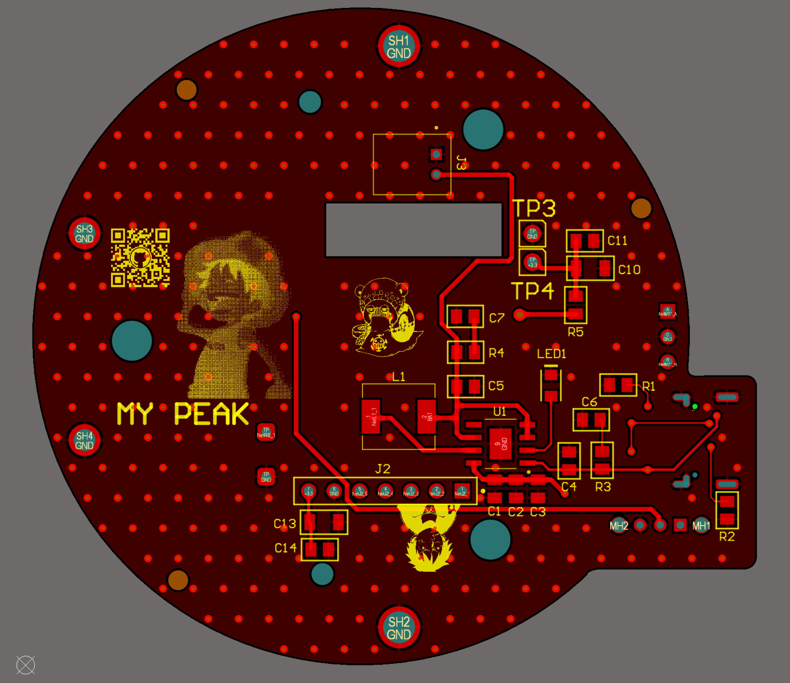
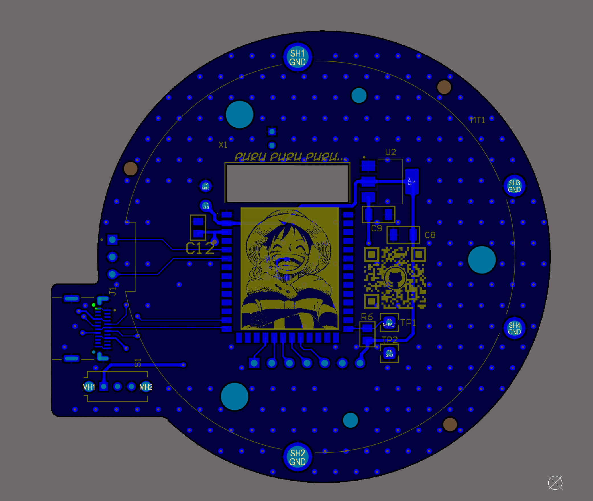

# DYCE PCB
---

The custom board that runs DYCE: a single round PCB sized to sit behind the screen,
hand-soldered and **powered up first try**. **100% offline**: no Wi-Fi, no radios used
for the game, randomness comes straight from the ESP32 hardware RNG.

## What's on it

- **MCU**: ESP32-S3-WROOM-1 (N16R8, 16 MB flash + 8 MB PSRAM)
- **Display**: GC9A01 1.28″ **round** 240×240 TFT, SPI
- **Input**: ring **rotary encoder** (the screen stays still while you spin the ring)
- **Power**: USB-C, Li-ion charging, side power button

## Pinout (firmware)

These match the firmware. Display pins are set at compile time in
[`../Firmware/platformio.ini`](../Firmware/platformio.ini), the encoder in
[`../Firmware/include/config.h`](../Firmware/include/config.h).

| Signal | GPIO | Notes |
|---|---|---|
| TFT SCLK | 14 | display SPI clock |
| TFT MOSI (SDA) | 13 | display SPI data |
| TFT DC | 12 | data / command |
| TFT CS | 11 | chip select |
| TFT RST | 10 | reset |
| TFT MISO | n/a | unused |
| Encoder A | 6 | `PIN_ENC_A` |
| Encoder B | 5 | `PIN_ENC_B` |

> No backlight pin, the GC9A01 module is driven directly. Flip the encoder direction
> with `ENC_DIR` in `config.h` if it reads backwards.

## Files

- **[`Schematics.pdf`](Schematics.pdf)**: full schematic.
- **[`Fabrication/`](Fabrication/)**: everything a board house needs.
  - `Gerber/`: copper, mask, silk, outline (`.GTL/.GBL/.GTS/.GBS/.GTO/.GBO/.GM`)
  - `Drill/`: NC drill files (round + slot holes)

## Order your own

1. Zip the contents of [`Fabrication/`](Fabrication/) (Gerber + Drill).
2. Upload to any board house: **[JLCPCB](https://jlcpcb.com/)**, **[PCBWay](https://www.pcbway.com/)**, etc.
3. Defaults are fine (1.6 mm, HASL or ENIG). The round outline is in the Gerbers, so no extra setup needed.

A full step-by-step assembly walk-through (board, screen, enclosure) is coming with the
**Instructables** guide. Found an issue or improved the layout?
[Open an issue](https://github.com/merlin-rce/Dyce/issues), schematic nitpicks welcome.
