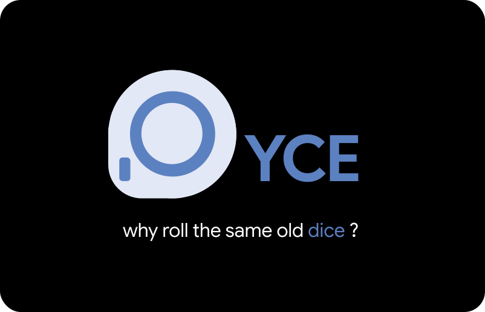

<div align="center">



**A premium, round, open-source electronic die.** 
Spin the ring, the circular screen
charges up, rolls a number and lands on it. ESP32-S3 · custom PCB · weighted enclosure · USB-C.

[**Live simulator**](https://merlin-rce.tech/Dyce) · [**Gallery**](Media/Gallery.md) · [**Firmware**](Firmware/) · [**Contribute**](CONTRIBUTING.md)

</div>

---

<div align="center">
  
</div>

## What it is

- A **round** die that feels like a product,
the screen sits inside a **ring encoder** and stays still while you spin the ring.
- **Custom PCB** (ESP32-S3, GC9A01 round TFT, USB-C, Li-ion charge), hand-soldered, **powered up first try**.
- **100% offline.** Rolls use the ESP32 hardware RNG (`esp_random`) with rejection sampling, so every face is exactly equally likely.
- First real hardware project by a Swiss electronics student, built in the open as a learning log.

## How to Use

- **Spin right** → the ring charges, then rolls and reveals a number.
- **Spin left** → change the odds: `1 in 2 / 5 / 10 / 50 / 99`, plus a **Contact** qr code of the repo.
- **Pause around ⅔** → a little easter egg ;)

Try it all in the **[live simulator](https://merlin-rce.tech/Dyce)**, no hardware needed.

## Build the firmware

C++ / [PlatformIO](https://platformio.org/), target ESP32-S3-WROOM-1.

```bash
git clone https://github.com/merlin-rce/Dyce.git

cd Dyce/Firmware

pio run -t upload      # build & flash
```

Wiring & schematic: [`PCB/`](PCB/) · code overview: [`Firmware/`](Firmware/).

## Print & build the hardware

Everything you need to make your own DYCE is in the repo:

- **3D-printed enclosure** → [`3D Files/`](3D%20Files/) with all the STL parts (body, encoder ring, screen holder, PCB cover, button cap).
- **PCB** → [`PCB/`](PCB/) with the [schematic](PCB/Schematics.pdf) plus ready-to-order **[Gerber & drill files](PCB/Fabrication/)** you can send to any board house (JLCPCB, PCBWay, etc.).

### Edit the 3D model (Onshape)

The full parametric CAD lives on Onshape:

**[Open the DYCE CAD model](https://cad.onshape.com/documents/9054087476b99494dbf8772b/w/43f19220b97c6495800911b1/e/0047a7d77bd93aa77dba2c59?renderMode=0&uiState=6a37b72d89f368f220412795)**

Want to tweak a part or design your own variation? **[Ask me for access](https://github.com/merlin-rce/Dyce/issues)**, then **make your own copy** (Onshape, *Make a copy*) so you can edit freely without touching the original.

## Make it your own

DYCE is **finished, but not closed.** Everything here is open so you can **build one,
tweak it, and make it better.** Flash a different animation, add new odds, rethink the
attract loop, redesign the enclosure, or fork the whole thing into your own gadget.
That's exactly what it's here for. If you make a variation, I'd love to see it.

> **A full step-by-step [Instructables](https://www.instructables.com/) build guide is
> coming soon**, every part, every solder joint, start to finish, so anyone can make
> their own. Watch this repo to catch it when it drops.

## Contribute

This is a learning project and **feedback / PRs are genuinely welcome**: schematic
nitpicks, firmware cleanups, enclosure ideas, anything. Start with **[CONTRIBUTING.md](CONTRIBUTING.md)**
or open an [issue](https://github.com/merlin-rce/Dyce/issues).

## Status

**Project finished**, built, working, and documented in the open.

| Hardware | Firmware | Enclosure |
|---|---|---|
| Working | Done | Done (could be better) |

## License

Firmware & code: **MIT** (see [`LICENSE`](LICENSE)).
Hardware and docs are intended as **CERN-OHL-S v2** and **CC BY-SA 4.0** respectively.
*To be confirmed before final.*

<div align="center">
  Built in Switzerland by <a href="https://github.com/merlin-rce">@merlin-rce</a> · learning as I go.
</div>
