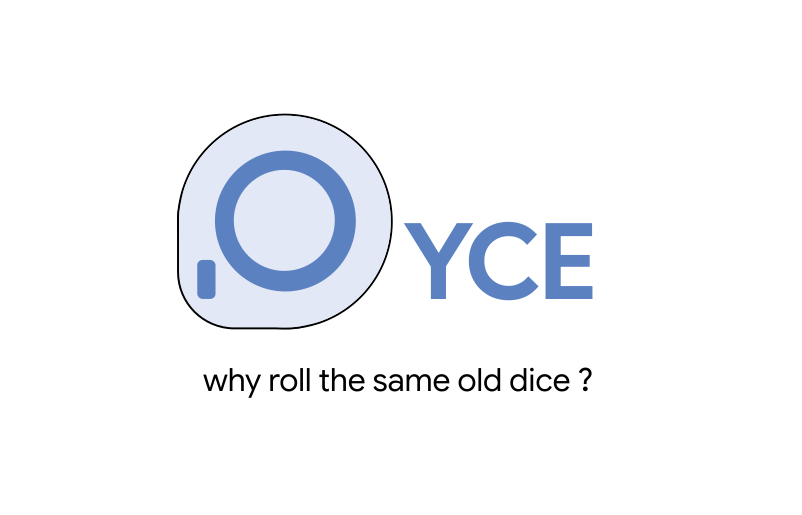

<div align="center">



**A premium, round, open-source electronic die.** Spin the ring, the circular screen
charges up, rolls a number and lands on it. ESP32-S3 · custom PCB · weighted enclosure · USB-C.

[**▶ Live simulator**](https://merlin-rce.tech/Dyce) · [**Gallery**](Media/Gallery.md) · [**Firmware**](Firmware/) · [**Contribute**](CONTRIBUTING.md)

</div>

---

<div align="center">
  
  
</div>

## What it is

- A **round** die that feels like a product, not a toy — the screen sits inside a **ring encoder** and stays still while you spin the ring.
- **Custom PCB** (ESP32-S3, GC9A01 round TFT, USB-C, Li-ion charge), hand-soldered, **powered up first try**.
- **100% offline.** Rolls use the ESP32 hardware RNG (`esp_random`) with rejection sampling, so every face is exactly equally likely.
- First real hardware project by a Swiss electronics student — built in the open as a learning log.

## How to play

- **Spin up** → the ring charges, then rolls and reveals a number.
- **Spin down** → change the odds: `1 in 2 / 5 / 10 / 50 / 99`, plus a **Contact** card.
- **Pause around ⅔** → a little hidden surprise. 🙂

Try it all in the **[live simulator](https://merlin-rce.tech/Dyce)** — no hardware needed.

## Build the firmware

C++ / [PlatformIO](https://platformio.org/), target ESP32-S3-WROOM-1.

```bash
git clone https://github.com/merlin-rce/Dyce.git
cd Dyce/Firmware
pio run -t upload      # build & flash
```

Wiring & schematic: [`PCB/`](PCB/) · code overview: [`Firmware/`](Firmware/).

## Contribute

This is a learning project and **feedback / PRs are genuinely welcome** — schematic
nitpicks, firmware cleanups, enclosure ideas, anything. Start with **[CONTRIBUTING.md](CONTRIBUTING.md)**
or open an [issue](https://github.com/merlin-rce/Dyce/issues).

## Status

| Hardware | Firmware | Enclosure |
|---|---|---|
| ✅ working | ✅ done | 🛠️ in progress |

## License

Firmware & code: **MIT** (see [`LICENSE`](LICENSE)).
Hardware and docs are intended as **CERN-OHL-S v2** and **CC BY-SA 4.0** respectively —
*to be confirmed before final.*

<div align="center">
  Built in Switzerland by <a href="https://github.com/merlin-rce">@merlin-rce</a> · learning as I go.
</div>
